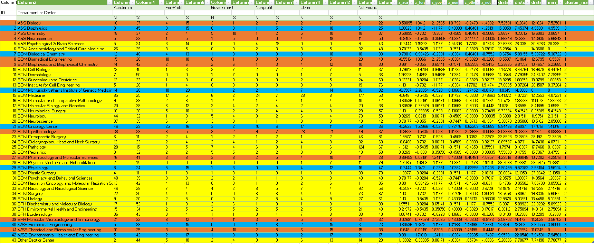

# PostDoc-CareerOutcome-Sector-Initital-Employment
Postdoctoral Career Outcomes for Life Sciences at Johns Hopkins University (Sector and Type) from the Next Generation Life Science Coalition. 

The repository contains excel files with the original downloaded data and cluster analysis for data found on postdoctoral careers in the life sciences for students at Johns Hopkins University. Analyzed the sector of initial employment portion only, not the type of initial employment. 

# Description of Findings: 
After evaluating the minimum distance to each of the cluster nodes, it was found that a lot of these departments were clusted together in what was deemed as cluster 2. Cluster 1 and cluster 3 both only had a handful of departments in these groups. What these findings mean is that many departments in the life sciences have similarities in the job sectors they go to for initial employment. This could be important for current PhDs/PostDocs to know what sector a lot of Johns Hopkins alumni are going to for the life sciences, and if they are in the same cluster group their departments may have more similarites in terms of employment that they did not know about. For the institution, for career fairs or seminar series, they can put these cluster groups together and tailor these types of networking and exposure evvents to each group in terms of where they typically end up for initial employment. 

Tabular Data with Cluster Groups:

 
# Outline: 
Industry Question - How are departments in the Life Scieces clustered together at Johns Hopkins University based on their sector of initial employment?
Data Question - What data is available and what tools can be used to answer this industry question?
Data Answer - There is data found within the Next Generation Life Science Coalition database, which can then be extracted from Tabula. A cluster analysis with z-scores can be done to see the relationship we want to find. 
Industry Answer - The data is able to show us relationships between the departments, and provides three cluster groups. 
# Website Links:
Data Source: https://provost.jhu.edu/education/graduate-and-professional-education/cngls/postdoctoral-career-outcomes-tabular-format/
Excel: https://github.com/csalley96/PostDoc-CareerOutcome-Sector-Initital-Employment/blob/master/Mini%20Project%203%20(CJS).xlsx , https://github.com/csalley96/PostDoc-CareerOutcome-Sector-Initital-Employment/blob/master/Original%20Data%20for%20Project%203%20(untouched).xlsx
# Simple Step-by-Step
1) Downloaded the data (in pdf form) from the data source link above
2) Went onto https://tabula.technology/ and extracted the pdf into .cvs format 
3) I uploaded the .cvs file in excel, used the "Text to Columns" Data Tool to split cells, and gave each department an ID number 
4) I calculated the average and standard deviation for each department and their respected sectors by N and %
5) I found the z-scores (%) for each sector based on their department using the STANDARDIZE command
6) I then found the distance for each z-scores (%) for each sector based on their department (found in step (5)) using the SUMXMY2 command
7) I calculated the minimum disastance for each department from the values found in step (6) using the MIN command
8) The minimum distance was then the indicator for which cluster group each department would be assigned to, which was found using the MATCH command
9) I then color coded the departments based on cluster groups
10) I used the VLOOKUP commmand to be able to look up different departments by ID and cluster group to see their z-scores (%)
